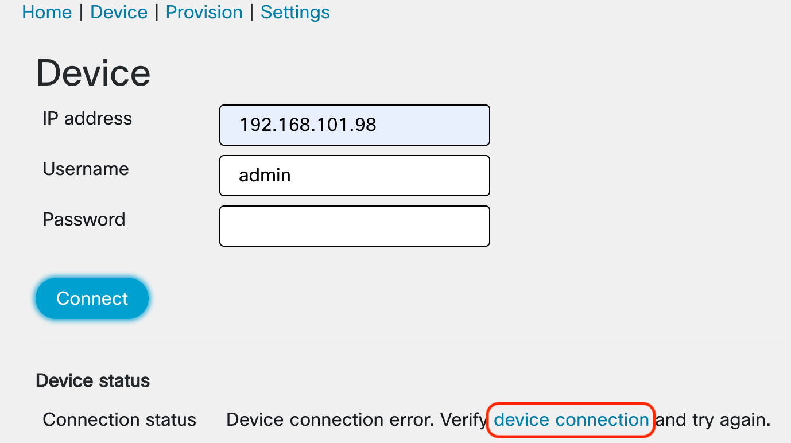
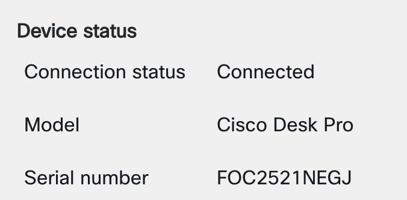
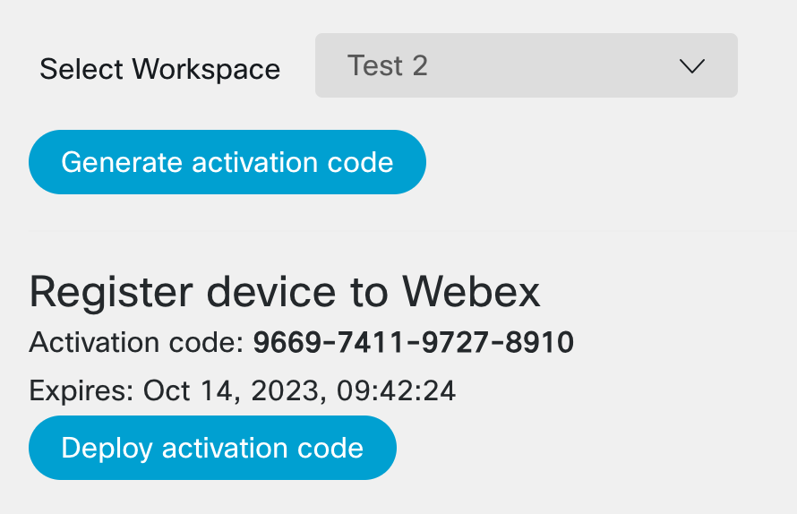

# Webex Device Provisioning

This is an example of a semi-automated Cisco video device provisioning. It was inspired by a discussion with a customer who wanted to deploy video devices remotely with minimal requirements on local staff. The staff is responsible for physical mounting and connecting the device to the network and display. Mounting in small rooms is not difficult and no special qualification should be needed. For mounting the devices in large or special purpose rooms, a trained staff is recommended. Setup and registration to Webex is performed remotely using this application. The application user needs to know only two parameters:

- **IP address** of the device - can be fetched from a DHCP server or read by the local staff from the screen or touch panel
- **room name and location** - should be provided by the local staff

The application performs following steps:

1. **pre-deployment configuration** - set http proxy, time and date parameters and language
2. **deployment** - create or select Webex workspace, generate activation code, deploy the code
3. **post-deployment configuration** - create a local user on the video device

The application is written in [React/Redux](https://react-redux.js.org) and is using [Momentum Design](https://momentum.design/components) React components.

## Settings

Each of the steps requires some set of parameters which can be configured in **Settings** section:

- pre-deployment parameters include: http proxy, date and time configuration and language selection.
- deployment parameters include: Webex authorization (admin account is needed) and "Close initial wizard after deployment" option. That one determines whether the initial wizard is automatically closed after activation. **If the device is being provisioned for MTR mode, this option should be turned off** (do not close the wizard) as the initial wizard contains MTR mode selection which cannot be performed via device's API. For the RoomOS mode, the parameter can be turned on.
- post-deployment parameters include: username and password of a local user that gets created on the device to ease the device management and troubleshooting.

The application is self-contained, there is no server-side. The settings and Webex authorization are stored in the browser.

## Application workflow

### Configure Settings

Settings should be checked first. Before using the application at least **Webex authorization needs to be valid**. Note that Webex authorization login requires a user with admin privileges.

### Connect the device

The first step of the deployment is a connection to the device in the **Device** section. If the device is in factory default state, there is **admin** user with **blank password**. After each factory reset the device re-generates its SSL certificate. The application detects it and displays a prompt to check the connection to the device, **device connection** link can be used to check the connectivity to the device and accept the certificate:

Once the connection to the device is established, the application displays the device information.

### Push the pre-deployment preferences to the device

In the **Provision** section the first step is **Deploy device preferences**. This may be important especially if the devices needs to communicate with Webex via HTTP proxy. At the moment the application doesn't check if the device has a working connectivity to the Webex cloud.

### Create and select Workspace

Once the pre-deployment preferences are in place, a Webex workspace to which the device will be registered, needs to be selected using **Select Workspace** drop-down list. If the workspace doesn't exists yet, it can be created using **Create Workspace** button. Then it can be found and selected in the **Select Workspace**.

### Generate and deploy activation code

Once the Workspace is selected the next step is activation code generation and deployment. The code is generated using **Generate activation code** button. Then the code is displayed with the **Deploy activation code** button.

Device status is periodically checked on Webex. Once the code is deployed, the connection status indication should be **connected** or **connected_with_issues**.

### Deploy post-deployment preferences (optional)

The last step includes generating a local user on the device. The user can be used to access the device directly without a need to connect via Webex Control Hub.

## Running the application

### Running locally

To run the application locally, just run **npm install** to install the required packages and then **npm start**. The application is then available at **http://localhost:4000**.

### Hosting the application

In order to host the application at a web server a new Webex integration needs to be created at <https://developer.webex.com>. For more information check the [documentation](https://developer.webex.com/docs/integrations). The application requires following scopes to be set in the integration - check the [src/api/webexConfig.json](src/api/webexConfig.json):

spark-admin:workspaces_write  
spark-admin:locations_write  
spark-admin:devices_read  
spark-admin:locations_read  
spark-admin:people_write  
spark-admin:workspace_locations_write  
spark-admin:workspace_locations_read  
spark-admin:workspaces_read  
spark-admin:devices_write  
spark-admin:people_read  
identity:placeonetimepassword_create  
spark:xapi_statuses  
spark:xapi_commands

Once the integration is created, enter its Integration Id, Client Id and Redirect URI to the [src/api/webexConfig.json](src/api/webexConfig.json). Redirect URI should be in the form of **https://fqdn_of_the_application_host/app_directory/callbackwebex**. The **app_directory** needs to be also set in [webpack.config.prod.js](webpack.config.prod.js) in the **publicPath** parameter (line 16).

Run **npm run build** and copy all content of **build** directory to the application hosting server.
